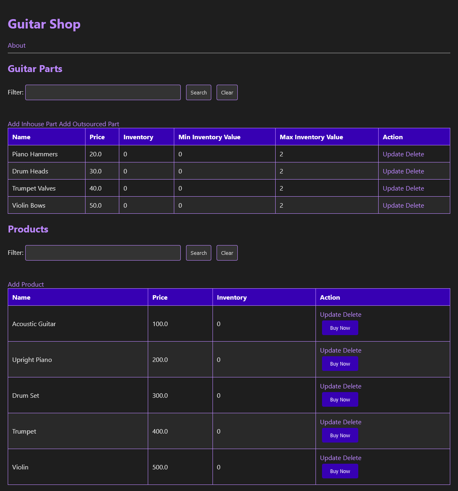

# Retail Inventory Manager

Retail Inventory Manager is a customizable Spring Framework application designed for inventory management in retail settings. It integrates a Java backend with an HTML frontend, offering a specialized solution for tracking products and parts in retail inventories, catering to various retail store types.

## Table of Contents

- [Technologies Used](#technologies-used)
- [Features](#features)
- [Installation](#installation)
- [Usage](#usage)
- [License](#license)

## Technologies Used

- Java
- Spring Framework
- HTML/CSS
- Maven

## Features

- Customizable HTML user interface tailored for a fictional retail store.
- Comprehensive product and part management in inventory.
- "Buy Now" functionality enabling product purchases.
- Inventory validation to maintain appropriate stock levels.
- Conditional logic for sample inventory additions.
- An About page with detailed information about the retail store.
- Unit testing to ensure the reliability of inventory functionalities.

## Installation

Follow these steps to get Retail Inventory Manager up and running:

1. Clone the project from its Git repository.
2. Open the project in your preferred IDE.
3. Install Maven dependencies to set up the project environment.
4. Launch the `DemoApplication` via the IDE to start managing retail inventory.

## Usage

The application provides a user-friendly interface for managing retail inventory, allowing users to add, remove, and update items, alongside features to purchase products and validate stock levels for efficient inventory management.

## License

[MIT License](LICENSE)
